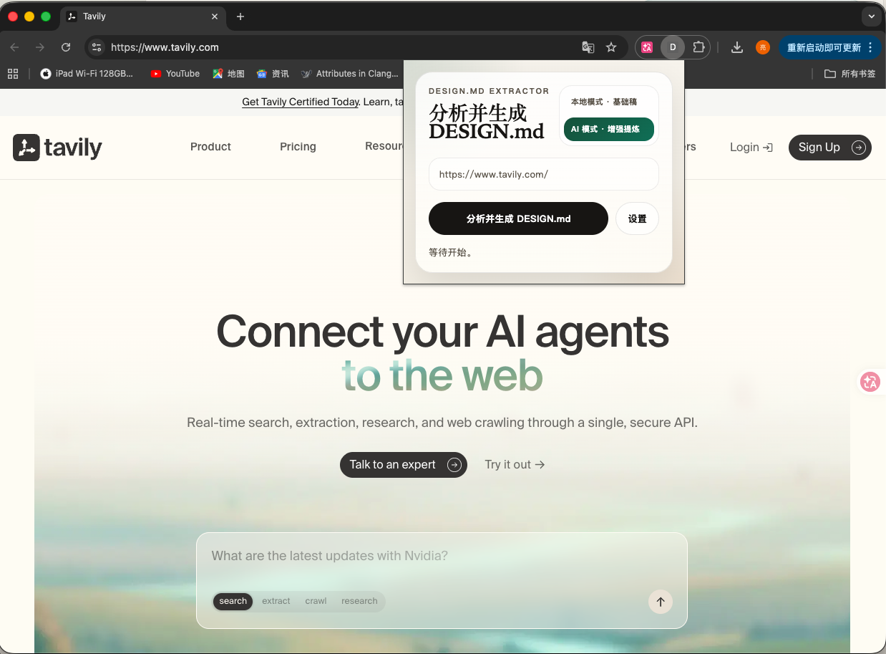
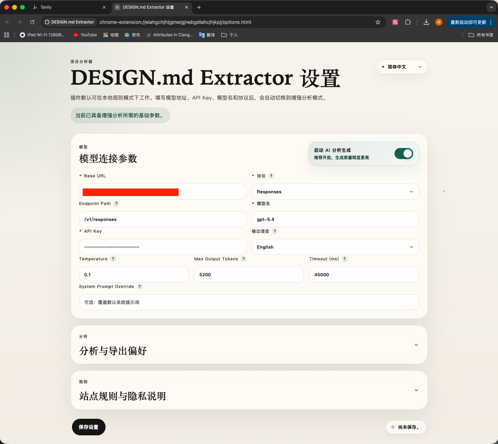

# DESIGN.md Extractor

一个面向网页 UI 的 Chrome 扩展：分析当前页面的设计结构，并导出一份高完成度的 `DESIGN.md`。

## 界面预览

### 设置页预览 1



### 设置页预览 2



## 核心能力

- 支持对当前 `http/https` 页面做 UI 结构分析，并导出 Markdown
- 支持 `本地模式` 与 `AI 模式` 两种生成路径
- 未完成 AI 配置时，自动回退到本地规则分析
- 已完整配置 AI 参数时，可在弹窗中直接切换 `本地模式 / AI 模式`
- 生成完成后直接触发浏览器下载，无需手动复制
- 设置页支持多语言界面、输出语言选择、分析参数调整和 AI 配置校验

## 当前产品形态

### 生成模式

- `本地模式 · 基础稿`
  - 不依赖远程模型
  - 速度更快
  - 适合先快速拿到结构化初稿
- `AI 模式 · 增强提炼`
  - 先做本地页面采样，再调用远程模型增强输出
  - 更适合追求更稳定的语言质量、结构完整度和参考文档拟合度

当 AI 参数不完整时，插件会自动以本地模式运行。

### 当前支持的模型协议

- `Responses`
- `Chat Completions`

### 当前默认生成策略

- 输出语言默认英文
- `Temperature` 默认 `0.1`
- `Max Output Tokens` 默认 `5200`
- 默认目标是尽量生成更完整、更接近参考 `DESIGN.md` 风格的结果

## 使用流程

1. 打开任意 `http` 或 `https` 页面。
2. 点击浏览器工具栏中的 `DESIGN.md Extractor`。
3. 视情况选择：
   - 直接用本地模式生成基础稿
   - 或切换到 AI 模式生成增强稿
4. 点击「分析并生成 DESIGN.md」。
5. 插件会自动下载生成的 Markdown 文件。

## AI 配置要求

若要启用 AI 模式，建议至少完整填写以下参数：

- `Base URL`
- `API Key`
- `Model`
- `Protocol`

设置页中如果未勾选启用 AI，保存时会进行显式提醒。

## 安装

### 直接加载源码目录

1. 打开 Chrome。
2. 进入 `chrome://extensions/`。
3. 打开右上角「开发者模式」。
4. 点击「加载已解压的扩展程序」。
5. 选择项目目录：

```text
.
```

### 加载打包产物

先执行构建脚本生成 `dist` 产物，再在 Chrome 中加载：

```text
dist/design-md-extractor
```

更多安装细节见 [MANUAL_INSTALL.md](./MANUAL_INSTALL.md)。

## 开发

### 运行测试

```bash
npm test
```

### 打包扩展

项目内置了一个打包脚本：

```bash
bash scripts/build.sh
```

也可以直接使用 npm 命令：

```bash
npm run build
```

脚本会执行以下动作：

1. 清理旧的 `dist` 目录。
2. 生成解压版扩展目录 `dist/design-md-extractor`。
3. 生成压缩包 `dist/design-md-extractor-chrome-extension.zip`。

### 构建后的产物

```text
dist/design-md-extractor
dist/design-md-extractor-chrome-extension.zip
```

## 目录结构

```text
.
├── manifest.json
├── popup.html / popup.css
├── options.html / options.css
├── src/
│   ├── background.js
│   ├── content.js
│   ├── popup.js
│   ├── options.js
│   └── core/
├── tests/
├── scripts/
│   └── build.sh
└── dist/
```

## 输出说明

导出的文件默认命名为：

```text
{domain}-DESIGN.md
```

文档默认围绕以下信息组织：

- Visual theme / atmosphere
- Color palette and roles
- Typography rules
- Component styling patterns
- Layout principles
- Depth and elevation
- Do's and don'ts
- Responsive behavior
- Agent prompt guide

如果开启「附加原始审计附录」，文档末尾会额外包含 `Appendix`。

## 已知限制

- 仅支持分析当前激活标签页中的 `http/https` 页面
- `chrome://`、扩展页、部分浏览器内置页面无法分析
- AI 模式依赖你自行提供可用的模型接口和 API Key

## 一句话理解这个项目

把当前网页快速提炼成一份结构化、可继续复用的 `DESIGN.md`。
